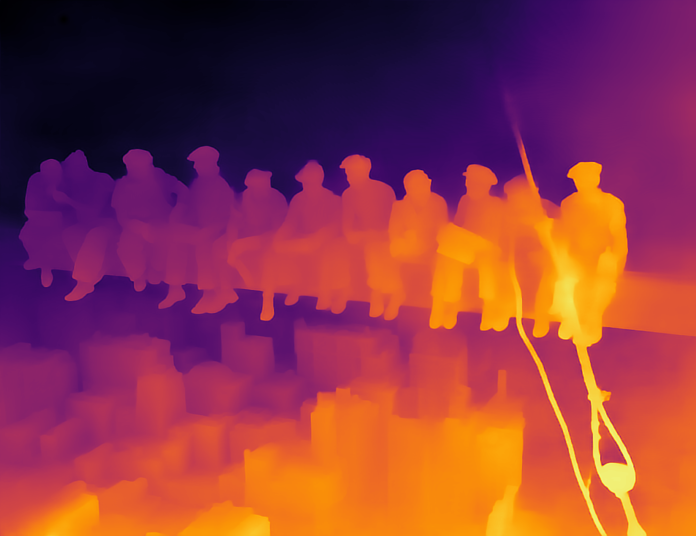
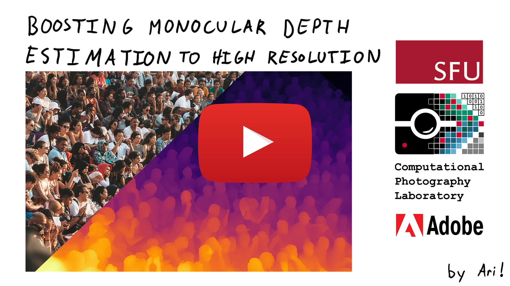
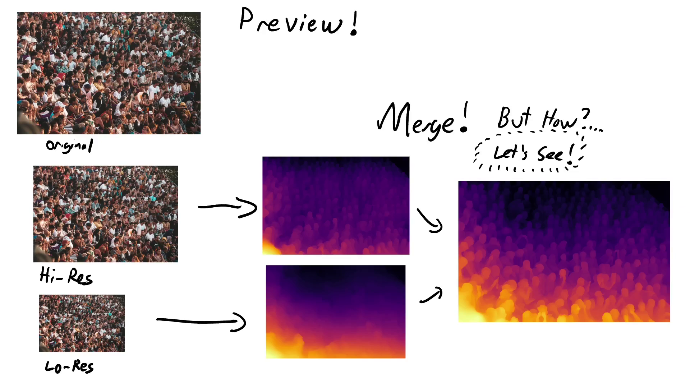
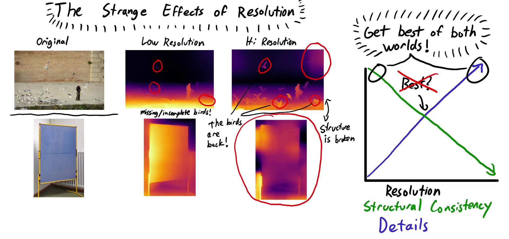
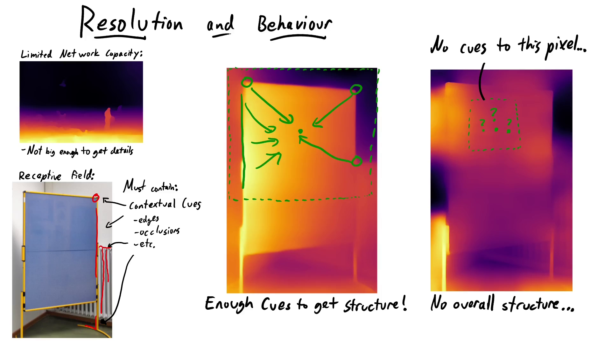
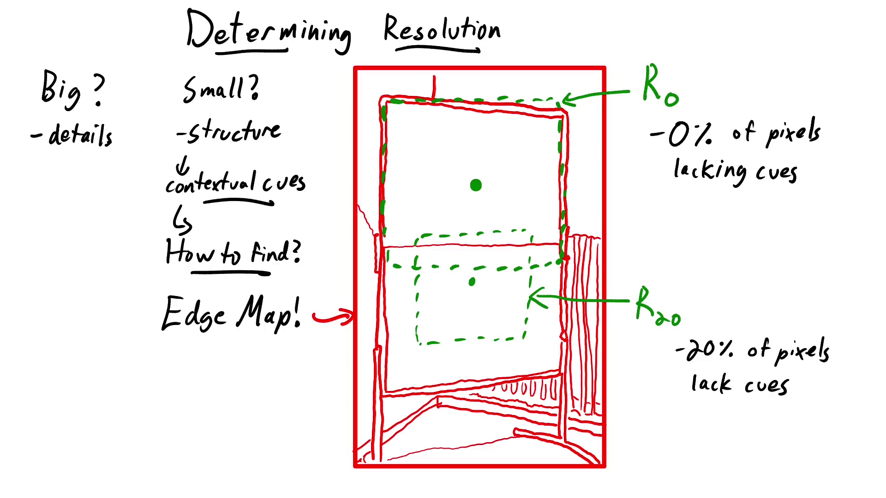
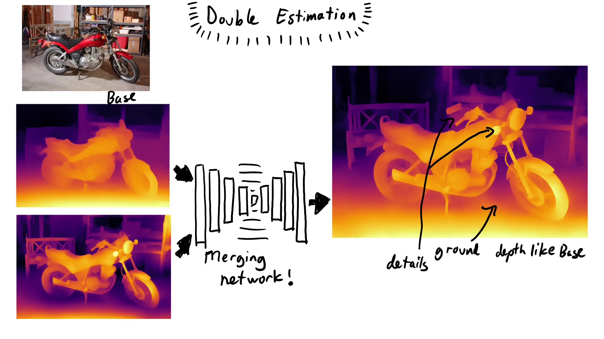
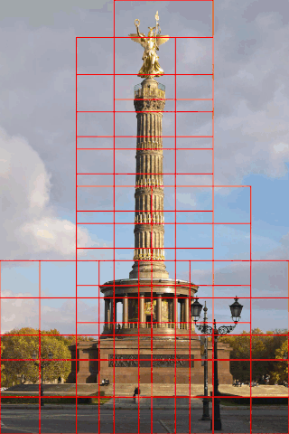
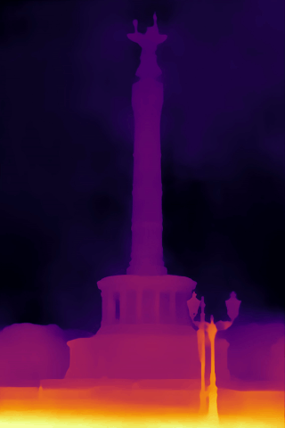

### **(NEW!)** [Boost Your Own depth](https://github.com/compphoto/BoostYourOwnDepth) with our new repo

We present a stand-alone implementation of our [Merging Operator](#method). This new repo allows using any pair of monocular depth estimations in our double estimation. This includes using separate networks for base and high-res estimations, using networks not supported by this repo (such as [Midas-v3](https://github.com/isl-org/MiDaS)), or using manually edited depth maps for artistic use. This will also be useful for scientists developing CNN-based MDE as a way to quickly apply double estimation to their own network. For more details please take a look [here](https://github.com/compphoto/BoostYourOwnDepth).

| Input | Original result | After manual editing of base|
|----|------------|------------|
||||


### **(NEW!)** [LeRes][2] is now supported within our method.

Here is a visualization of the improvement gained using [LeRes][2] instead of [MiDas][1].
|RGB | Our method using [MiDaS][1] | Our method using [LeRes][2] (**NEW**!) |
|----|------------|-----------|
||||


### (NEW!) Maximum resolution can be set for a faster run time.

Use **\--max_res** as input argument for run.py in combination with **--Final** to set a limit on the resolution of the results that our method generates.

We provide this parameter as a trade-off between run-time and resolution. Using this reduces the run-time if only a result up to *specific-megapixel* is needed.

This parameter sets a limit on the bigger dimension of the result in term of pixels (while keeping aspect ratio). For example, to generate results with a bigger dimension size up to 2000 pixels use the following:   

```python
python run.py --Final --max_res 2000 --data_dir PATH_TO_INPUT --output_dir PATH_TO_RESULT --depthNet 0
```


### Boosting Monocular Depth Estimation Models to High-Resolution via Content-Adaptive Multi-Resolution Merging 

> S. Mahdi H. Miangoleh\*, Sebastian Dille\*, Long Mai, Sylvain Paris, Yağız Aksoy.
> [Main pdf](http://yaksoy.github.io/papers/CVPR21-HighResDepth.pdf),
> [Supplementary pdf](http://yaksoy.github.io/papers/CVPR21-HighResDepth-Supp.pdf),
> [Project Page](http://yaksoy.github.io/highresdepth/).

[](https://www.youtube.com/watch?v=lDeI17pHlqo)

We propose a method that can generate highly detailed high-resolution depth estimations from a single image. Our method is based on optimizing the performance of a pre-trained network by merging estimations in different resolutions and different patches to generate a high-resolution estimate. 

Try our model easily on Colab : [](https://colab.research.google.com/github/compphoto/BoostingMonocularDepth/blob/main/Boostmonoculardepth.ipynb)


### Change log:

* (**NEW!**) Now you can set the maximum resolution of the results to reduce runtime.  
* **(NEW!)** Our method implementation using [LeReS][2] is now available. [July 2021]
* A Quick overview of the method is now presented in README.md. [July 2021]
* [Google Colaboratory notebook](./Boostmonoculardepth.ipynb) is now available.  [June 2021]   [](https://colab.research.google.com/github/compphoto/BoostingMonocularDepth/blob/main/Boostmonoculardepth.ipynb)
* Merge net training dataset generation [instructions](./dataset_prepare/mergenet_dataset_prepare.md) is now available. [June 2021] 
* Bug fix. [June 2021, July 2021]


## Method

We use **existing** *monocular depth estimation* networks to generate highly detailed estimations **without re-training**.

We achieve our results by getting several estimations at different resolutions. We then merge these into a structurally consistent high-resolution depth map followed by a local boosting to enhance the results and generate our final result.




##### Observations

Monocular depth estimation uses contextual cues such as occlusions or the relative sizes of objects to estimate the structure of the scene.

We will use a pre-trained [MiDas-v2][1] here, but our analysis with the [SGR][2] network also supports our claims.

When we feed the image to the network at different resolutions, some interesting patterns arise.
At lower resolutions, many details in the scene are missing, such as birds in this example. At high resolutions, however, we start to see inconsistent overall structure, and this flat board gets significantly less flat. The advantage is that the network is able to generate high frequency details.
This shows that there is a trade-off between structural consistency and high-frequency details with respect to input resolution.




##### Explanations

We explain this behavior through two properties of convolutional neural networks: limited **receptive field** size and **network capacity**.
The lack of high frequency details in low resolutions are due to a limited network capacity. A small network that generates the structure of a complex scene cannot also generate fine details.

The loss of structure at high resolutions comes from a limited receptive field size. The receptive field is the region around a pixel that contributes to the estimation at that pixel. It is set by the network configuration and training resolution, and effectively gets smaller as resolution increases. At a low resolution, every pixel can see the edges of the board, so the network judges that this is a flat wall. At a high resolution, however, some pixels do not receive any contextual information. This results in large structural inconsistencies.



##### Best resolution search 

For any given image, we determine the highest resolution that will result in a consistent structure by making sure that every pixel has contextual information. For this purpose, we need the distribution of contextual cues in the image. We approximate contextual cues with a simple edge map. 

The resolution where every pixel is at most a half receptive field size away from context edges is called R_0.
When we increase the resolution any further, structural inconsistencies will arise but more details will be generated. When 20% of the pixels do not receive any context, we call this resolution R_20.
**Note that R_0 and R_20 depend on the image content!**



##### Double Estimation

We are still able to go beyond R0 by merging the high-frequency details in the R20 resolution onto the structure of the base resolution. We call this **Double Estimation**.
We train an image-to-image translation network to merge the low-resolution depth range of the base with the high-resolution details of R_20. It does so without inheriting the structural inconsistencies of the high-res input. This way, we go beyond R_0 and generate more details by using R_20 as our high-resolution input. In fact, the network is so robust against low-frequency artifacts that we can even use R_20 as our high-resolution input.



##### Local Boosting

Note that R20 is *bounded by the smoothest regions* in the image, while there are image patches that could support a higher resolution.
We choose candidate patches by tiling the image and discarding all patches without useful details (step1). The leftover patches are expanded until their edge density matches that of the image(step2). Finally, we merge a double estimation for each patch onto our R20 results and generate our final results (step3).


|Step 1: Tile and discard | Step 2: Expand | Step 3: Merge|
|-------------------------|----------------|--------------|
||||

## Setup

We Provided the implementation of our method using [MiDas-v2][1], [LeReS][2] and [SGRnet][3] as the base. Note that [MiDas-v2][1] and [SGRnet][3] estimate inverse depth while [LeReS][2] estimates depth. 

### Environments
Our mergenet model is trained using torch 0.4.1 and python 3.7 and is tested with torch<=1.8.

Download our mergenet model weights from [here](https://sfu.ca/~yagiz/CVPR21/latest_net_G.pth) and put it in 
> .\pix2pix\checkpoints\mergemodel\latest_net_G.pth

To use [MiDas-v2][1] or [LeReS][2] as base:
Install dependancies as following:
```sh
conda install pytorch torchvision opencv cudatoolkit=10.2 -c pytorch
conda install matplotlib
conda install scipy
conda install scikit-image
```
For MiDaS-v2, download the model weights from [MiDas-v2][1] and put it in 
> ./midas/model.pt

```sh
activate the environment
python run.py --Final --data_dir PATH_TO_INPUT --output_dir PATH_TO_RESULT --depthNet 0
```

For LeReS, download the model weights from [LeReS][2] (Resnext101) and put it in root:
> ./res101.pth

```sh
activate the environment
python run.py --Final --data_dir PATH_TO_INPUT --output_dir PATH_TO_RESULT --depthNet 2
```

To use [SGRnet][3] as base:
Install dependencies as following:
```sh
conda install pytorch=0.4.1 cuda92 -c pytorch
conda install torchvision
conda install matplotlib
conda install scikit-image
pip install opencv-python
```
Follow the official [SGRnet][3] repository to compile the syncbn module in ./structuredrl/models/syncbn.
Download the model weights from [SGRnet][3] and put it in 
> ./structuredrl/model.pth.tar

```sh
activate the environment
python run.py --Final --data_dir PATH_TO_INPUT --output_dir PATH_TO_RESULT --depthNet 1
```

Different input arguments can be used to generate R0 and R20 results as discussed in the paper. 

```python
python run.py --R0 --data_dir PATH_TO_INPUT --output_dir PATH_TO_RESULT --depthNet #[0,1 or 2]
python run.py --R20 --data_dir PATH_TO_INPUT --output_dir PATH_TO_RESULT --depthNet #[0,1 or 2]
```

To generate the results with *CV.INFERNO* colormap use **--colorize_results** like the sample below:

```python
python run.py --colorize_results --Final --data_dir PATH_TO_INPUT --output_dir PATH_TO_RESULT --depthNet #[0,1 or 2]
```

### Evaluation
Fill in the needed variables in the following matlab file and run:
>./evaluation/evaluatedataset.m

* **estimation_path** : path to estimated disparity maps
* **gt_depth_path** : path to gt depth/disparity maps
* **dataset_disp_gttype** : (true) if ground truth data is disparity and (false) if gt depth data is depth.
* **evaluation_matfile_save_dir** : directory to save the evalution results as .mat file. 
* **superpixel_scale** : scale parameter to run the superpixels on scaled version of the ground truth images to accelarate the evaluation. use 1 for small gt images.


### Training

Navigate to [dataset preparation instructions](./dataset_prepare/mergenet_dataset_prepare.md) to download and prepare the training dataset. 

```sh
python ./pix2pix/train.py --dataroot DATASETDIR --name mergemodeltrain --model pix2pix4depth --no_flip --no_dropout
```
```sh
python ./pix2pix/test.py --dataroot DATASETDIR --name mergemodeleval --model pix2pix4depth --no_flip --no_dropout
```


## Citation

This implementation is provided for academic use only. Please cite our paper if you use this code or any of the models.
```
@INPROCEEDINGS{Miangoleh2021Boosting,
author={S. Mahdi H. Miangoleh and Sebastian Dille and Long Mai and Sylvain Paris and Ya\u{g}{\i}z Aksoy},
title={Boosting Monocular Depth Estimation Models to High-Resolution via Content-Adaptive Multi-Resolution Merging},
journal={Proc. CVPR},
year={2021},
}
```

## Credits

The "Merge model" code skeleton (./pix2pix folder) was adapted from the [pytorch-CycleGAN-and-pix2pix][4] repository. 

For MiDaS, LeReS and SGR inferences we used the scripts and models from [MiDas-v2][1], [LeReS][2] and [SGRnet][3] respectively (./midas, ./lib and ./structuredrl folders). 

Thanks to [k-washi](https://github.com/k-washi) for providing us with a Google Colaboratory notebook implementation.

[1]: https://github.com/intel-isl/MiDaS/tree/v2
[2]: https://github.com/aim-uofa/AdelaiDepth/tree/main/LeReS
[3]: https://github.com/KexianHust/Structure-Guided-Ranking-Loss
[4]: https://github.com/junyanz/pytorch-CycleGAN-and-pix2pix

